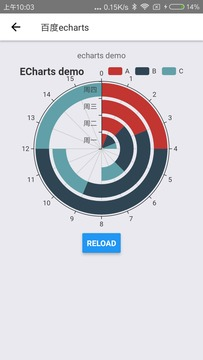

### react-native-web-echarts

#### 介绍
要在 [`react-native`](http://facebook.github.io/react-native/) 上使用 [`echarts`](http://echarts.baidu.com) 的图表库，目前方法主要是使用 `react-native` 的 `webview` 利用网页的形式加载 `echarts` 的图形。

#### 安装

使用 `npm` 安装
```
npm install react-native-web-echarts --save
```
使用 `yarn` 安装（推荐）
```
yarn add react-native-web-echarts
```

若当前版本不能用，可以指定版本安装: react-native-web-echarts@1.1.7

#### 使用

##### 示例

```
import React from 'react'
import { View, Text, Button } from 'react-native'
import Echarts from 'react-native-web-echarts'

export default class EcahrtsDemo extends React.Component {
  state = {
    data1: [1, 2, 3, 4],
    data2: [2, 4, 6, 8],
    data3: [1, 2, 3, 4]
  }
  render () {
    const { data1, data2, data3 } = this.state
    const option = {
      title: {
        text: 'ECharts demo'
      },
      tooltip: {},
      angleAxis: {
      },
      radiusAxis: {
        type: 'category',
        data: ['周一', '周二', '周三', '周四'],
        z: 10
      },
      polar: {
      },
      series: [{
        type: 'bar',
        data: data1,
        coordinateSystem: 'polar',
        name: 'A',
        stack: 'a'
      }, {
        type: 'bar',
        data: data2,
        coordinateSystem: 'polar',
        name: 'B',
        stack: 'a'
      }, {
        type: 'bar',
        data: data3,
        coordinateSystem: 'polar',
        name: 'C',
        stack: 'a'
      }],
      legend: {
        show: true,
        data: ['A', 'B', 'C'],
        right: 0
      }
    }
    return <View style={{flex: 1}}>
      <View style={{flex: 1, alignItems: 'center'}}>
        <Text>{'\necharts demo\n'}</Text>
        <Echarts
          option={option}
          height={300}
        />
        <Button
          title="reload"
          onPress={() => { this.setState({
            data1: [...new Array(4)].map(_ => Math.ceil(Math.random() * (10))),
            data2: [...new Array(4)].map(_ => Math.ceil(Math.random() * (10))),
            data3: [...new Array(4)].map(_ => Math.ceil(Math.random() * (10)))
          })} }
        />
      </View>
    </View>
  }
}
```

##### 效果
android



##### 参数
- `option` echarts的参数，跟echarts使用一样，参考[`echarts`文档](http://echarts.baidu.com/option.html)\
- `source` source资源配置目录，即tpl资源文件目录，默认安卓product模式下在 `android/app/src/main/assets` 目录下，其他情况使用 `require('./tpl.html')` ，如用户需要自行配置目录，先将 `tpl.html` 复制到相应目录下，然后配置 `source` 路径即可
- `width` （可选/默认为**300**）组件宽度，可以是数字或百分比
- `height` （可选/默认**300**）组件高度，可以是数字或百分比
- `style` （可选）除了宽度和高度已经固定设置以外， `style` 属性可以为组件添加其他样式
- 其他 `webview` 属性：（可选）
  + `onLoadStart`
  + `onLoad`
  + `onError`
  + `onLoadEnd`
  + `renderLoading`
  + `renderError`

#### 说明
- 项目原理是在页面中建立一个固定大小的 `webview` 用来以网页的形式加载 `echarts` 的组件，所有的图表都是加载的一个html里面的 `echarts` 组件，根据设置 `option` 内容的不同表现出不同的图形。
- 由于是web加载方式，所有图形显示会有一定的延迟
- **由于在 `Android` 环境下，开发模式和生产模式读取文件资源形式[不同](http://blog.csdn.net/luo_xinran/article/details/71787831)，所以在生产模式下需要复制项目目录下的 ` `tpl.html` 文件到 `android/app/src/main/assets` 目录下，打包后才能正常显示。**
- 开发者可以使用任意版本的 `echarts` 库，只需要将目录下 `echarts.min.js` 文件替换为需要的版本即可（注意安卓需要同时替换 `assets` 目录下的文件）
- 开发者可以使用 `echarts` 的其他[扩展库](http://echarts.baidu.com/download-extension.html)，需要修改 `tpl.html` 文件，在 `<heard>` 中引入 `echarts` 文件的后面 添加对应库的引用，如 `<script src="echarts-liquidfill.js"></script>`，同时需要将对应的库文件复制到本项目目录下（安卓版同时需要在原生`assets`目录下）
- 支持 `react-native-windows` ，参考： [示例](https://github.com/jyiL/react-native-windows)
